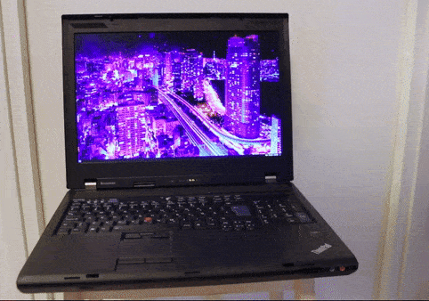

# w700ds-screen-switcher


The Lenovo Thinkpad W700ds is a special laptop with a second pull-out screen. This is a script to turn the second
monitor on and off.

## Why is this needed?
When the second screen is opened or closed, the computer sends an "XF86Display" keystroke. Therefore, the computer does
not know whether the monitor was physically opened or closed. This script checks to see if the second monitor is turned
on using xrandr, and turns the second monitor on or off based on that information. If the second screen is turned off,
it will turn it on. If the second screen is turned on, this script will turn it off. The script assumes that the screen
is physically closed when the screen is off.

## Usage
This script should be mapped to the XF86Display keystroke to activate it when the screen is opened and closed. 

For example
in i3/sway window manager:
```
bindsym XF86Display exec python /location/to/script/screenchange.py
```
&nbsp;

&nbsp;

This script is basically a wrapper for the xrandr command line program. I am planning to develop a better solution
using C and libxrandr directly. If you have any experience with libxrandr and xrandr, all help is appreciated. 